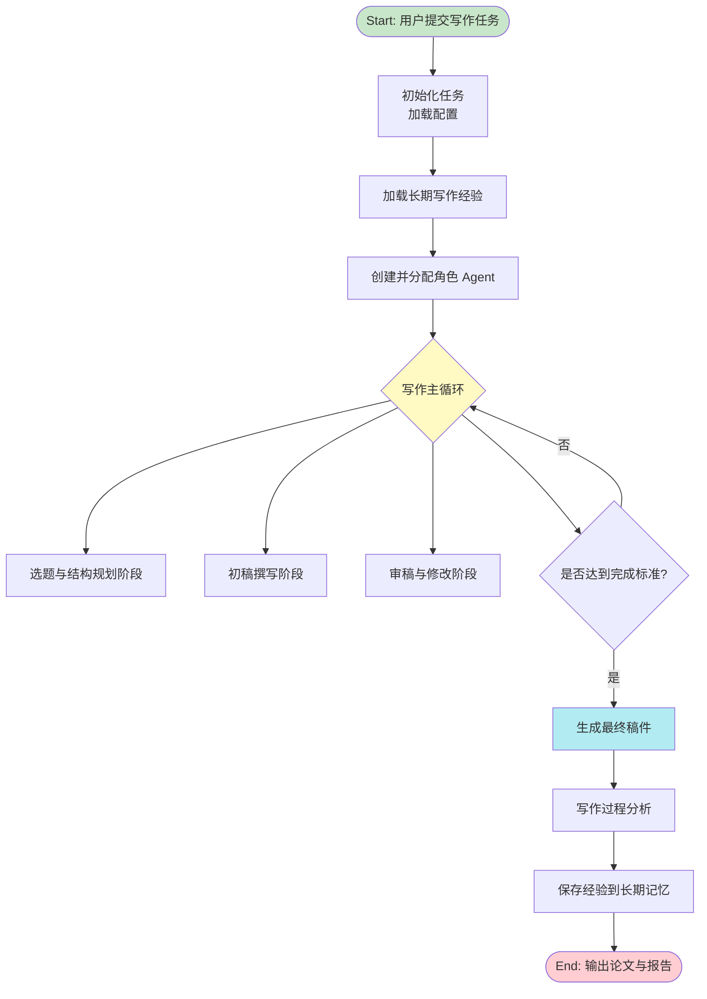
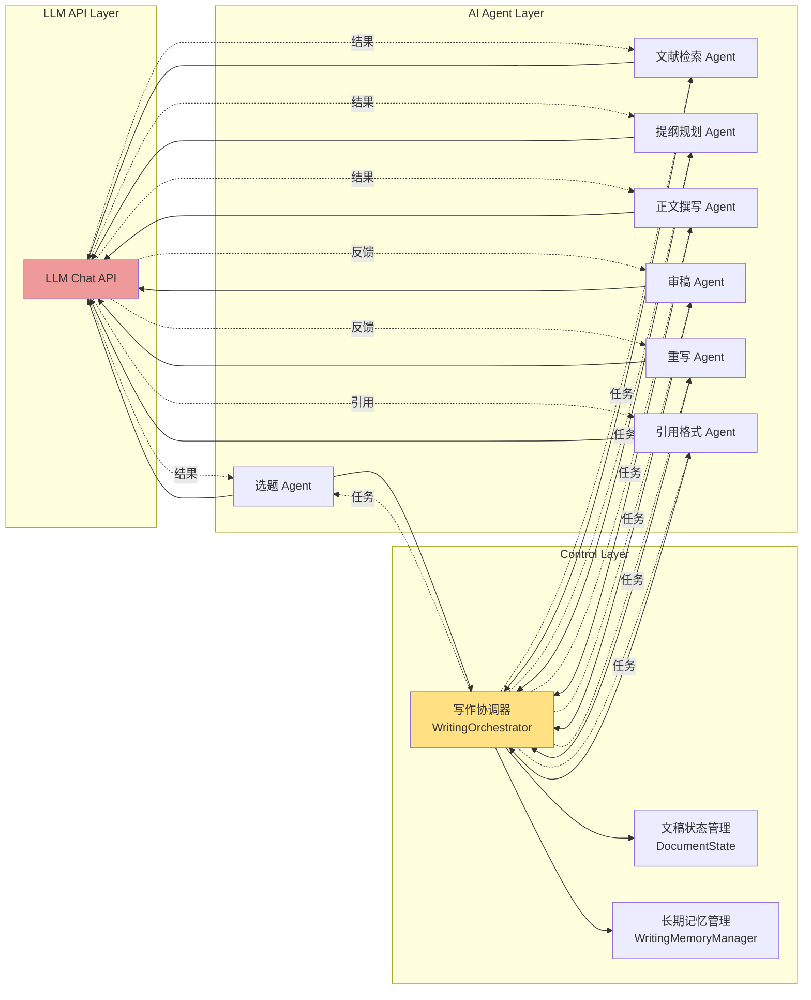
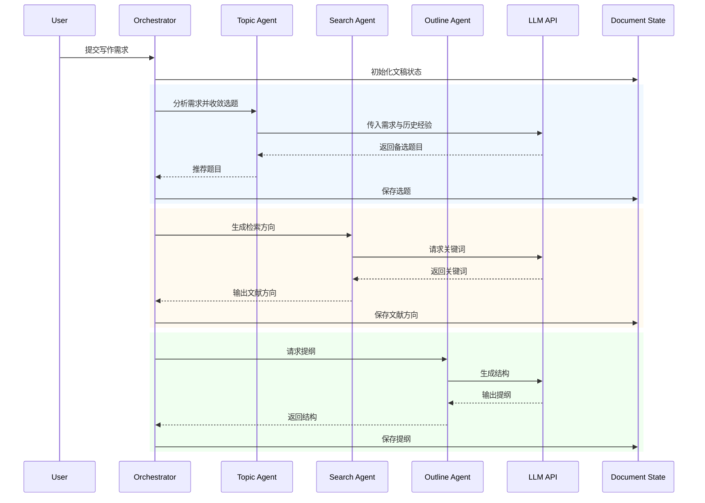
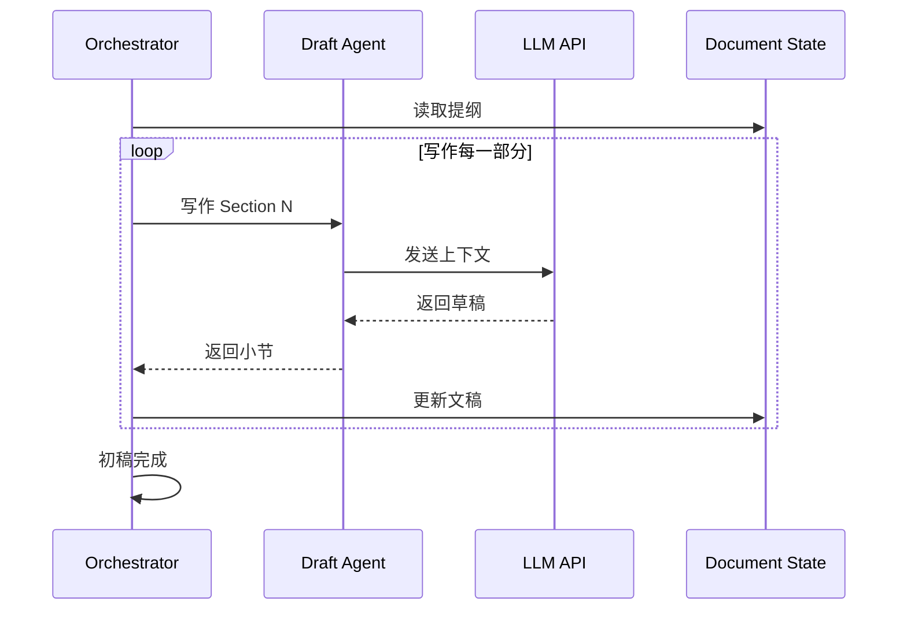
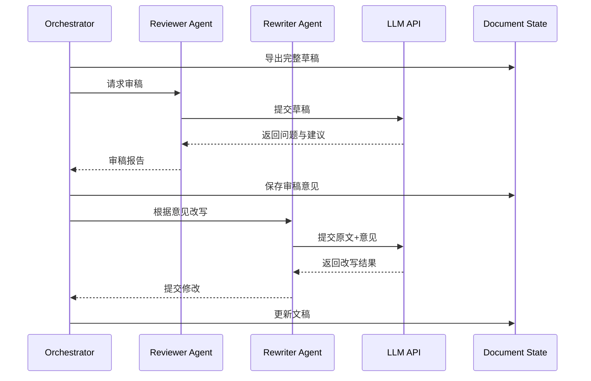
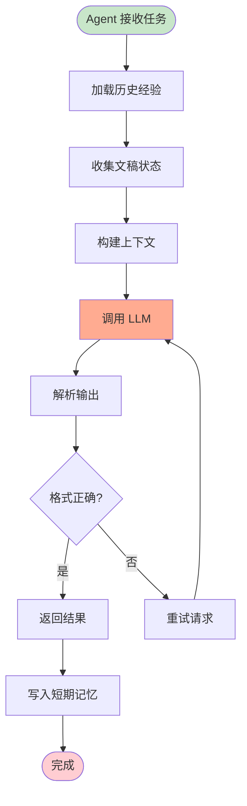
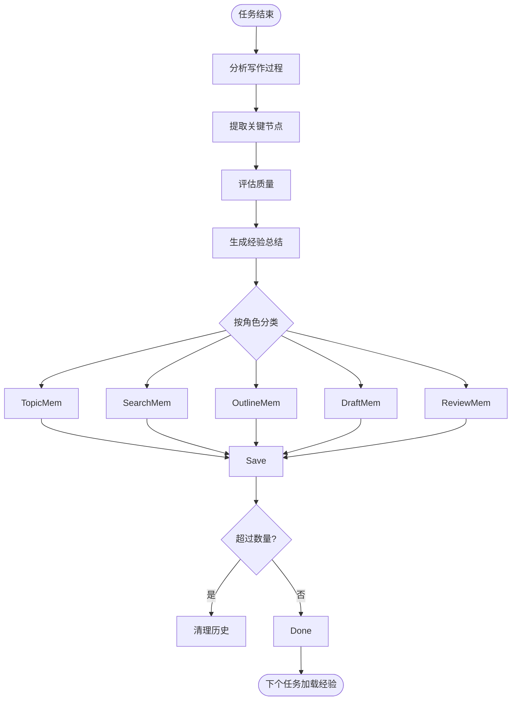
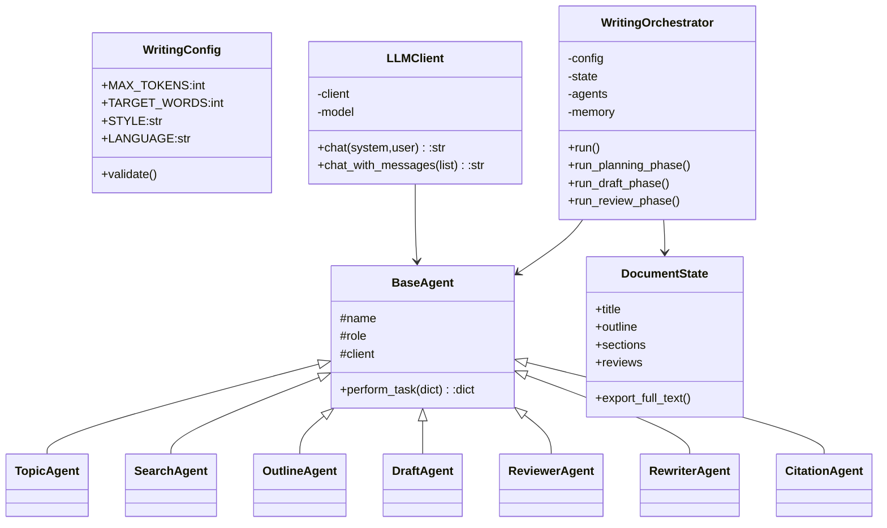
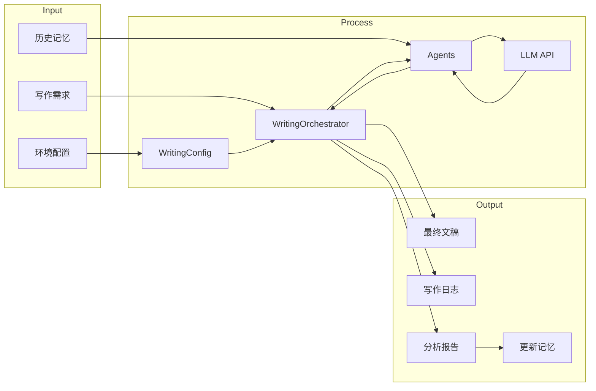

# ai-writing-workflow

```mermaid
graph TB
    Start([Start: 用户提交写作任务]) --> Init[初始化任务<br/>加载配置]
    Init --> LoadMemory[加载长期写作经验]
    LoadMemory --> AssignAgents[创建并分配角色 Agent]
    AssignAgents --> MainLoop{写作主循环}

    MainLoop --> PlanPhase[选题与结构规划阶段]
    MainLoop --> DraftPhase[初稿撰写阶段]
    MainLoop --> ReviewPhase[审稿与修改阶段]
    MainLoop --> CheckDone{是否达到完成标准?}

    CheckDone -->|是| Finalize[生成最终稿件]
    CheckDone -->|否| MainLoop

    Finalize --> Analyze[写作过程分析]
    Analyze --> SaveMemory[保存经验到长期记忆]
    SaveMemory --> End([End: 输出论文与报告])

    style Start fill:#C8E6C9
    style End fill:#FFCDD2
    style MainLoop fill:#FFF9C4
    style Finalize fill:#B2EBF2
```

```mermaid
graph LR
    subgraph "LLM API Layer"
        API[LLM Chat API]
    end

    subgraph "Control Layer"
        Orchestrator[写作协调器<br/>WritingOrchestrator]
        DocState[文稿状态管理<br/>DocumentState]
        Memory[长期记忆管理<br/>WritingMemoryManager]
    end

    subgraph "AI Agent Layer"
        TopicAgent[选题 Agent]
        SearchAgent[文献检索 Agent]
        OutlineAgent[提纲规划 Agent]
        DraftAgent[正文撰写 Agent]
        ReviewerAgent[审稿 Agent]
        RewriterAgent[重写 Agent]
        CitationAgent[引用格式 Agent]
    end

    Orchestrator --> DocState
    Orchestrator --> Memory

    Orchestrator -.任务.-> TopicAgent
    Orchestrator -.任务.-> SearchAgent
    Orchestrator -.任务.-> OutlineAgent
    Orchestrator -.任务.-> DraftAgent
    Orchestrator -.任务.-> ReviewerAgent
    Orchestrator -.任务.-> RewriterAgent
    Orchestrator -.任务.-> CitationAgent

    TopicAgent --> API
    SearchAgent --> API
    OutlineAgent --> API
    DraftAgent --> API
    ReviewerAgent --> API
    RewriterAgent --> API
    CitationAgent --> API

    API -.结果.-> TopicAgent
    API -.结果.-> SearchAgent
    API -.结果.-> OutlineAgent
    API -.结果.-> DraftAgent
    API -.反馈.-> ReviewerAgent
    API -.反馈.-> RewriterAgent
    API -.引用.-> CitationAgent

    TopicAgent --> Orchestrator
    SearchAgent --> Orchestrator
    OutlineAgent --> Orchestrator
    DraftAgent --> Orchestrator
    ReviewerAgent --> Orchestrator
    RewriterAgent --> Orchestrator
    CitationAgent --> Orchestrator

    style Orchestrator fill:#FFE082
    style API fill:#EF9A9A
```

```mermaid
sequenceDiagram
    participant User as User
    participant OR as Orchestrator
    participant Topic as Topic Agent
    participant Search as Search Agent
    participant Outline as Outline Agent
    participant API as LLM API
    participant DS as Document State

    User->>OR: 提交写作需求
    OR->>DS: 初始化文稿状态

    rect rgb(240,248,255)
        OR->>Topic: 分析需求并收敛选题
        Topic->>API: 传入需求与历史经验
        API-->>Topic: 返回备选题目
        Topic-->>OR: 推荐题目
        OR->>DS: 保存选题
    end

    rect rgb(255,250,240)
        OR->>Search: 生成检索方向
        Search->>API: 请求关键词
        API-->>Search: 返回关键词
        Search-->>OR: 输出文献方向
        OR->>DS: 保存文献方向
    end

    rect rgb(240,255,240)
        OR->>Outline: 请求提纲
        Outline->>API: 生成结构
        API-->>Outline: 输出提纲
        Outline-->>OR: 返回结构
        OR->>DS: 保存提纲
    end
```

```mermaid
sequenceDiagram
    participant OR as Orchestrator
    participant Draft as Draft Agent
    participant API as LLM API
    participant DS as Document State

    OR->>DS: 读取提纲

    loop 写作每一部分
        OR->>Draft: 写作 Section N
        Draft->>API: 发送上下文
        API-->>Draft: 返回草稿
        Draft-->>OR: 返回小节
        OR->>DS: 更新文稿
    end

    OR->>OR: 初稿完成
```

```mermaid
sequenceDiagram
    participant OR as Orchestrator
    participant Reviewer as Reviewer Agent
    participant Rewriter as Rewriter Agent
    participant API as LLM API
    participant DS as Document State

    OR->>DS: 导出完整草稿
    OR->>Reviewer: 请求审稿

    Reviewer->>API: 提交草稿
    API-->>Reviewer: 返回问题与建议
    Reviewer-->>OR: 审稿报告
    OR->>DS: 保存审稿意见

    OR->>Rewriter: 根据意见改写
    Rewriter->>API: 提交原文+意见
    API-->>Rewriter: 返回改写结果
    Rewriter-->>OR: 提交修改
    OR->>DS: 更新文稿
```

```mermaid
graph TB
    Start([Agent 接收任务]) --> LoadMem[加载历史经验]
    LoadMem --> GatherState[收集文稿状态]
    GatherState --> BuildContext[构建上下文]

    BuildContext --> CallAPI[调用 LLM]
    CallAPI --> Parse[解析输出]

    Parse --> Validate{格式正确?}
    Validate -->|是| Return[返回结果]
    Validate -->|否| Retry[重试请求]

    Retry --> CallAPI

    Return --> Update[写入短期记忆]
    Update --> End([完成])

    style Start fill:#C8E6C9
    style End fill:#FFCDD2
    style CallAPI fill:#FFAB91
```

```mermaid
graph TB
    Start([任务结束]) --> Analyze[分析写作过程]
    Analyze --> Extract[提取关键节点]
    Extract --> Eval[评估质量]
    Eval --> Insight[生成经验总结]

    Insight --> Split{按角色分类}
    Split --> TopicMem
    Split --> SearchMem
    Split --> OutlineMem
    Split --> DraftMem
    Split --> ReviewMem

    TopicMem --> Save
    SearchMem --> Save
    OutlineMem --> Save
    DraftMem --> Save
    ReviewMem --> Save

    Save --> Limit{超过数量?}
    Limit -->|是| Clean[清理历史]
    Limit -->|否| Done

    Done --> Next([下个任务加载经验])
```

```mermaid
classDiagram
    class WritingConfig {
        +MAX_TOKENS:int
        +TARGET_WORDS:int
        +STYLE:str
        +LANGUAGE:str
        +validate()
    }

    class LLMClient {
        -client
        -model
        +chat(system,user):str
        +chat_with_messages(list):str
    }

    class BaseAgent {
        #name
        #role
        #client
        +perform_task(dict):dict
    }

    class TopicAgent
    class SearchAgent
    class OutlineAgent
    class DraftAgent
    class ReviewerAgent
    class RewriterAgent
    class CitationAgent

    BaseAgent <|-- TopicAgent
    BaseAgent <|-- SearchAgent
    BaseAgent <|-- OutlineAgent
    BaseAgent <|-- DraftAgent
    BaseAgent <|-- ReviewerAgent
    BaseAgent <|-- RewriterAgent
    BaseAgent <|-- CitationAgent

    class DocumentState {
        +title
        +outline
        +sections
        +reviews
        +export_full_text()
    }

    class WritingOrchestrator {
        -config
        -state
        -agents
        -memory
        +run()
        +run_planning_phase()
        +run_draft_phase()
        +run_review_phase()
    }

    LLMClient --> BaseAgent
    WritingOrchestrator --> DocumentState
    WritingOrchestrator --> BaseAgent
```

```mermaid
graph LR
    subgraph Input
        UserReq[写作需求]
        Env[环境配置]
        PastMem[历史记忆]
    end

    subgraph Process
        Config[WritingConfig]
        Orchestrator[WritingOrchestrator]
        Agents[Agents]
        API[LLM API]
    end

    subgraph Output
        DraftOut[最终文稿]
        Log[写作日志]
        Ana[分析报告]
        NewMem[更新记忆]
    end

    UserReq --> Orchestrator
    Env --> Config
    Config --> Orchestrator

    PastMem --> Agents
    Orchestrator --> Agents
    Agents --> API
    API --> Agents
    Agents --> Orchestrator

    Orchestrator --> DraftOut
    Orchestrator --> Log
    Orchestrator --> Ana
    Ana --> NewMem
```
