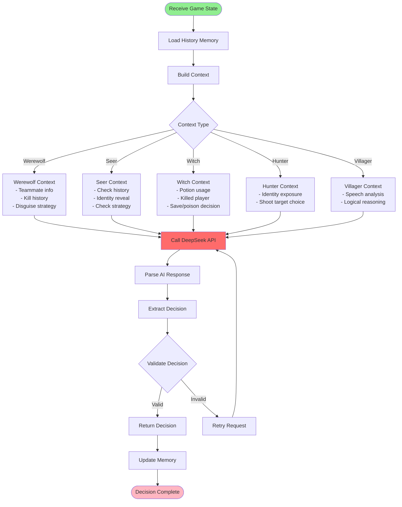

# ai-writing-workflow

## Multi-Agent Interaction Architecture

## Night Phase Flow

## Day Phase Flow

## Single AI Agent Decision Flow

## Long-term Memory System Flow

## Core Class Relationship Diagram

## Data Flow Diagram

## Key Design Patterns

### 1. Observer Pattern
- **GameState** maintains game state
- **WerewolfGame** observes and responds to state changes
- **AI Agents** make decisions based on state

### 2. Strategy Pattern
- **BasePlayer** defines common interface
- Each role class implements different strategy methods
- Runtime calls corresponding strategy based on role type

### 3. Singleton Pattern
- **DeepSeekClient** globally shares one API client
- **MemoryManager** centrally manages memory files

### 4. Template Method Pattern
- **BasePlayer** defines decision-making process framework
- Subclasses override `_build_system_prompt()` to customize behavior

## Performance Optimization Points

1. **API Call Optimization**
   - Cache API client instance
   - Concurrent processing of independent AI decisions (optional)

2. **Memory System Optimization**
   - Limit history record count (MAX_HISTORY_GAMES)
   - Load only relevant role memories

3. **Prompt Optimization**
   - Streamline context information
   - Use structured output format
   - Word limits prevent overly long responses

4. **State Management Optimization**
   - Incremental updates instead of full copy
   - Lazy loading of historical records
